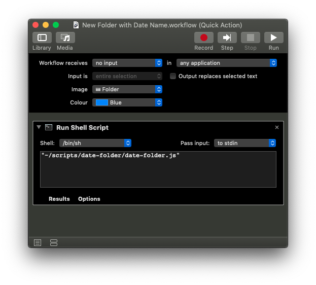

# date-folder
Create a new folder and name it with today's (or yesterday's, or tomorrow's) date in ISO format (e.g. `2020-02-24`). Uses the first Finder window's path as parent for the new folder. If there is no Finder window open, it uses your Desktop folder instead.

Use it as-is from Terminal, or create a Quick Action with Automator and assign it a global shortcut (I use `⌃⌥⌘N`, for instance).

*Note*: There is minimal error checking, so [YMMV](https://encyclopedia2.thefreedictionary.com/Your+mileage+may+vary "Your Mileage May Vary").
